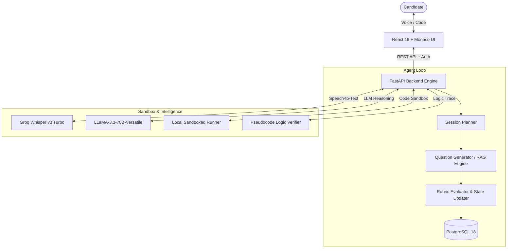

# AdaptIQ: AI-Powered Voice-First Adaptive Interview Coach

[](https://fastapi.tiangolo.com/)
[](https://vitejs.dev/)
[](https://groq.com/)
[](https://openai.com/)
[](https://www.postgresql.org/)

> **AdaptIQ** is an agentic, voice-first technical interview platform that dynamically scales question difficulty ($Level\ 1 \to 5$) turn-by-turn based on candidate performance. It combines sub-second speech transcription, an interactive Monaco coding editor with sandboxed execution, and an AI-powered pseudocode logic verifier to prepare candidates for high-stakes technical interviews.

---

## 🌟 Key Features

### 1. Dual Preparation Modes
* **Mode A: Targeted Role (JD + Resume Gap Analysis)**
  * Upload your resume and paste a target Job Description.
  * Semantic gap analysis computes match percentages and surfaces missing technical competencies to target in the interview.
* **Mode B: Curriculum Mastery**
  * Spans 7 foundational CS subjects: *Data Structures & Algorithms, Operating Systems, DBMS, Computer Networks, OOP, HR & Behavioral, and Quantitative Aptitude*.

### 2. Conversational Voice-First Interface
* **Audio Orb & Sub-Second Latency**: Real-time voice interaction powered by Groq `whisper-large-v3-turbo` (<800ms STT).
* Candidate thought process is captured verbally, simulating the real-time dynamics of top-tier FAANG/tier-1 technical interviews.

### 3. Multi-Language Code Sandbox & Pseudocode Verifier
* **Multi-Language Execution**: Isolated execution sandbox for Python, JavaScript, C++, Java, and C with a 4.0-second safety timeout.
* **AI Pseudocode Logic Engine**: Algorithmic verification analyzing step-by-step logic, pointer shifts, invariant traces, and time/space complexity without failing on compiler syntax.
* **SQL Query Workspace**: Clean, dedicated query runner for database normalization, joins, and indexing questions.

### 4. Dynamic Difficulty State Machine (Planner $\to$ Executor $\to$ Critic)
* Maintains session state memory turn-by-turn.
* Difficulty scales dynamically ($Level\ 1 \to 5$):
  * **Score $\ge 80\%$**: Escalates difficulty to probe depth.
  * **Score $60\% - 79\%$**: Maintains current level to reinforce concepts.
  * **Score $< 60\%$**: Gracefully downscales difficulty to help the candidate rebuild confidence, targeting foundational prerequisites.

### 5. Candidate Analytics & Mastery Heatmap
* Tracks score progression over time.
* Capped **Targeted Weak-Topic Heatmap** displaying candidate priority areas for focused reinforcement.

---

## 🏗️ System Architecture



---

## 📁 Repository Structure

```
AI-Powered Voice-First Adaptive Interview Coach/
├── backend/
│   ├── app/
│   │   ├── api/v1/          # Endpoints (auth, session, questions, evaluation)
│   │   ├── core/            # Settings, PostgreSQL connection, security
│   │   ├── models/          # SQLAlchemy relational models
│   │   ├── schemas/         # Pydantic validation schemas
│   │   ├── services/        # Orchestrator, RAG, CodeRunner, Evaluator
│   │   └── main.py          # FastAPI app entry point
│   ├── tests/               # End-to-end integration and unit test suite
│   ├── requirements.txt     # Python dependencies
│   └── run_phase1_ingestion.py # Textbook PDF ingestion utility
├── frontend/
│   ├── src/
│   │   ├── components/      # Navbar, Audio Orb, Timer, Question Card
│   │   ├── context/         # AuthContext state management
│   │   ├── pages/           # Dashboard, ModeSelect, Interview, Report
│   │   └── services/        # API client
│   ├── index.html
│   ├── package.json
│   └── vite.config.js
├── data/                    # Textbooks, topic trees, fine-tuning datasets
├── VIVA_AND_DEMO_GUIDE.md   # Step-by-step viva presentation & demo script
├── .env.example             # Configuration template
└── README.md                # Project documentation
```

---

## ⚡ Quick Start

### Prerequisites
* **Python**: 3.10+
* **Node.js**: 18+ & npm
* **PostgreSQL**: 16+ (or automatic SQLite fallback)
* **Groq API Key**: Free tier from [console.groq.com](https://console.groq.com)

### 1. Backend Setup
```bash
# Clone the repository
git clone https://github.com/your-username/adaptiq-interview-coach.git
cd adaptiq-interview-coach

# Set up Python virtual environment
cd backend
python -m venv venv
# Windows:
.\venv\Scripts\activate
# Linux/macOS:
source venv/bin/activate

# Install dependencies
pip install -r requirements.txt

# Configure environment variables
cd ..
copy .env.example .env
# Edit .env with your GROQ_API_KEY and DATABASE_URL
```

Start the backend server:
```powershell
& "backend\venv\Scripts\python.exe" -m uvicorn backend.app.main:app --host 127.0.0.1 --port 8000 --reload
```
* API Documentation: `http://localhost:8000/docs`
* Health Check: `http://localhost:8000/health`

### 2. Frontend Setup
```bash
cd frontend
npm install
npm run dev
```
* Web Application: `http://localhost:5173`

---

## 🧪 Testing

To run the automated end-to-end integration tests:
```powershell
# Set root in PYTHONPATH and run tests
$env:PYTHONPATH="."
& "backend\venv\Scripts\python.exe" backend/tests/test_phase8_e2e.py
```

---

## 📖 Viva & Project Defense Guide

For academic defense, examiner FAQs, and a step-by-step demonstration walkthrough, refer to [VIVA_AND_DEMO_GUIDE.md](VIVA_AND_DEMO_GUIDE.md).

---

## 📜 License

Distributed under the MIT License. See `LICENSE` for more information.
